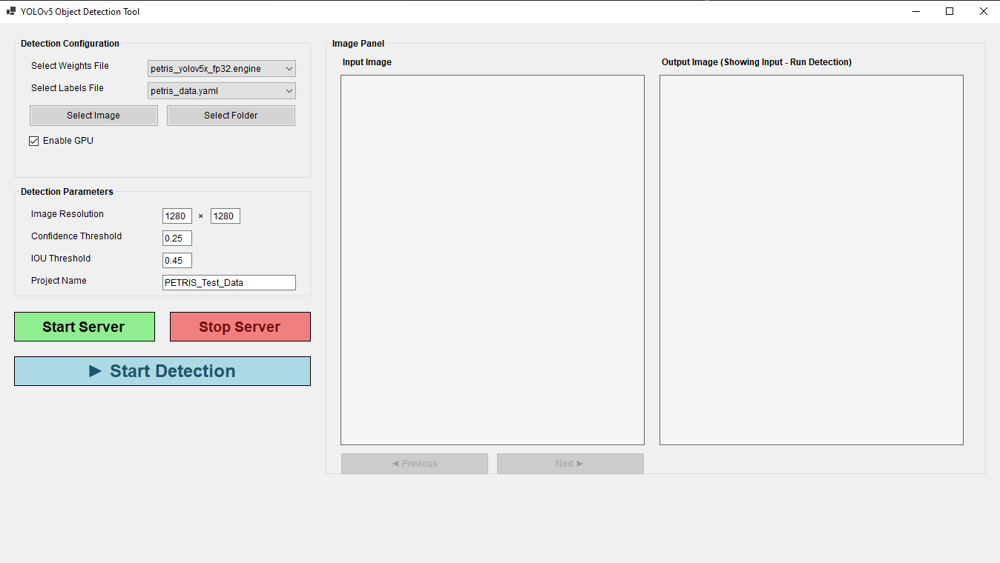

# Test Software for AI Automatic Mixer Cleaning Machine

# Getting Started: Download Project Repo
Clone the repo
```bash
git clone https://github.com/17kaushalsingh/YOLOv5-Object-Detection-Tool
```

# UI


## Testing The App: Download YOLOv5x Models for PETRIS to Models Directory

### Option 1: Manual Download

YOLOv5x Models for Petris <br>
NOTE: If unable to download, please request access at kaushal.singh@nikko-net.co.jp

1. [petris_yolov5x.pt](https://drive.google.com/uc?id=199GTyTxzaTxSp6QhKvgdIbYYgs9LpD7t)
2. [petris_yolov5x_fp16.onnx](https://drive.google.com/uc?id=1qx567W8z4xtbN3X9JhmRZiMmEBLb7f0T)
3. [petris_yolov5x_fp32.onnx](https://drive.google.com/uc?id=1PsMTw9vmfGM7j5LLFFiZadvA7_rBWhN0)
4. [petris_yolov5x_fp16.engine](https://drive.google.com/uc?id=1KNQwq29hXc4nyMnTsmccHBOGq4hsTdfO)
5. [petris_yolov5x_fp32.engine](https://drive.google.com/uc?id=1CIql-aBZStBnAjMO6jrzQnri_WhoeTS6)
6. [petris_data.yaml](https://drive.google.com/uc?id=1580AgoYQuoL2BKhLW0fB8fQAibn9YffK)

### Option 2: Download using gdrive(gdown) API

Run this command to download the models
```bash
pip install gdown
cd Models && python download_models.py && cd ..
```

# Create .exe app

## 1. Add Required Files as Embedded Resources
- Add dependency files (YOLOv5 repository and models) as embedded resources to the C# solution explorer
- Add code to extract dependencies during first app run or if dependencies are missing
- Include all necessary YAML configuration files

## 2. Switch to Release Build
- In Visual Studio, go to the toolbar (near the green "Start" button)
- Change the build configuration from Debug → Release
- This ensures all debug info is removed and the app is optimized for performance

## 3. Build the Project
- Press Ctrl + Shift + B or go to Build → Build Solution
- The compiled .exe will be in: `bin\Release\`

## 4. Error Handling and Logging
- Add try-catch blocks and show user-friendly messages
- Log errors to a text file using System.IO
- Test all features to ensure proper exception handling

## 5. Create an Installer (Recommended for Distribution)
Use one of the following methods:

### Option 1: ClickOnce (Built-in to Visual Studio)
- Right-click the project → Publish
- Choose Folder as the target
- This creates a simple installer with automatic updates capability

### Option 2: Custom Installer
Use free tools like:
1. [Inno Setup](https://jrsoftware.org/isinfo.php)
2. [NSIS (Nullsoft Scriptable Install System)](https://nsis.sourceforge.io/Main_Page)
- Bundle your .exe, assets, and all dependencies
- Customize the installer GUI for better user experience

### Option 3: MSIX Packaging
- Great for deploying to Windows Store or enterprise environments
- Follow the [Microsoft MSIX Packaging Guide](https://docs.microsoft.com/en-us/windows/msix/package/packaging-uwp-apps)

## 6. Test on Another Machine
Try running the application on a different PC that doesn't have Visual Studio installed.

Ensure:
- All DLLs and external files are bundled correctly
- .NET Desktop Runtime is installed ([Download .NET Runtime](https://dotnet.microsoft.com/download/dotnet))
- Conda environment can be created with necessary Python dependencies
- YOLOv5 and models extract correctly

## 7. Code Signing (Recommended)
- Purchase a code-signing certificate from a trusted certificate authority
- Sign your executable and installer to prevent "unknown publisher" warnings
- This increases user trust and bypasses Windows SmartScreen warnings


# File Specific README
1. Detect TRT Server (Python) <br>
  [Code](detect_trt_server.py/) <br>
  [Documentation](README/Detect_TRT_Server.md/)

2. Server (Python) <br>
  [Code](server.py/) <br>
  [Documentation](README/Server.md/)

3. Form 1 (X#) <br>
  [Code](Form1.cs/) <br>
  [Documentation](README/Form1.md/)

4. Yolo Application UI (C#) <br>
  [Code](YoloApplicationUI.cs/) <br>
  [Documentation](README/YoloApplicationUI.md/)

5. Yolo Initial Setup (C#) <br>
  [Code](YoloInitialSetup.cs/) <br>
  [Documentation](README/YoloInitialSetup.md/)

6. Yolo Detcetion Service (C#) <br>
  [Code](YoloDetectionService.cs/) <br>
  [Documentation](README/YoloDetectionService.md/)
