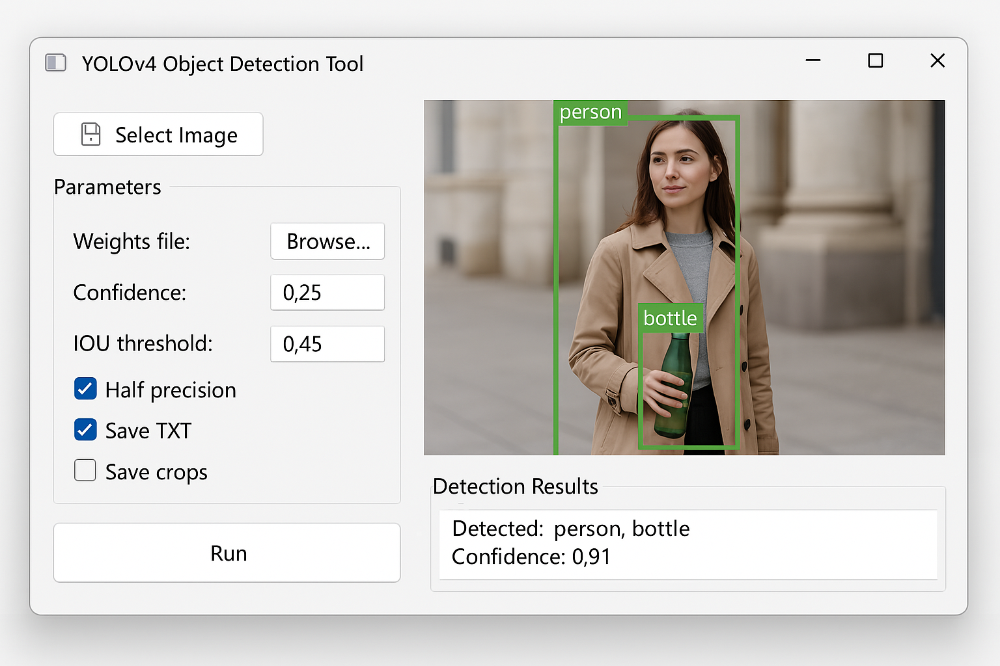
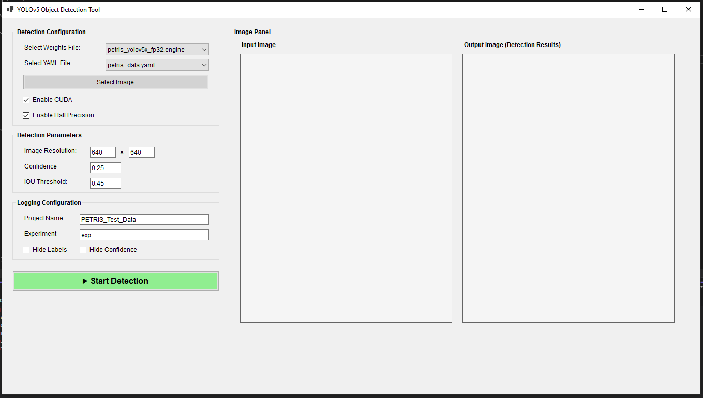

# UI Design
## UI Designs (Suggestions)

## Input Panel
### Detection Configuration
    weights
    data
    source
    device
    half
    
### Detection Parameters
    imgsz
    conf-thres
    iou-thres

### Logging Parameters
    project
    name
    hide-labels
    hide-conf

## Image Panel
    Contains two picture boxes, placed side by side
    Input picture box displays image as soon as the source image is selected
    Output picture box displays output image after tensor rt inferences are run

# Actual UI
